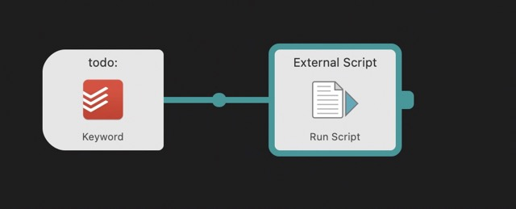
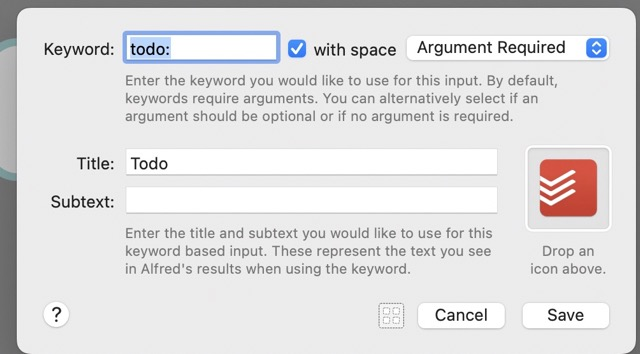
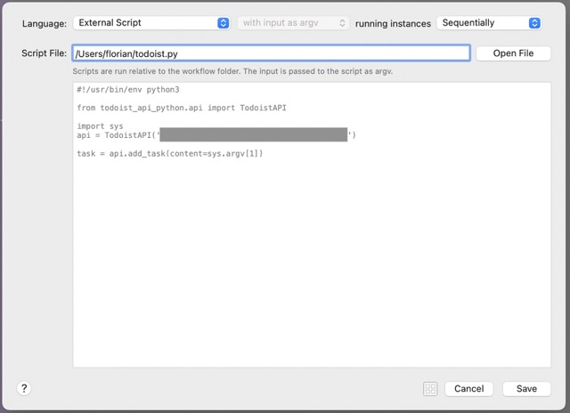
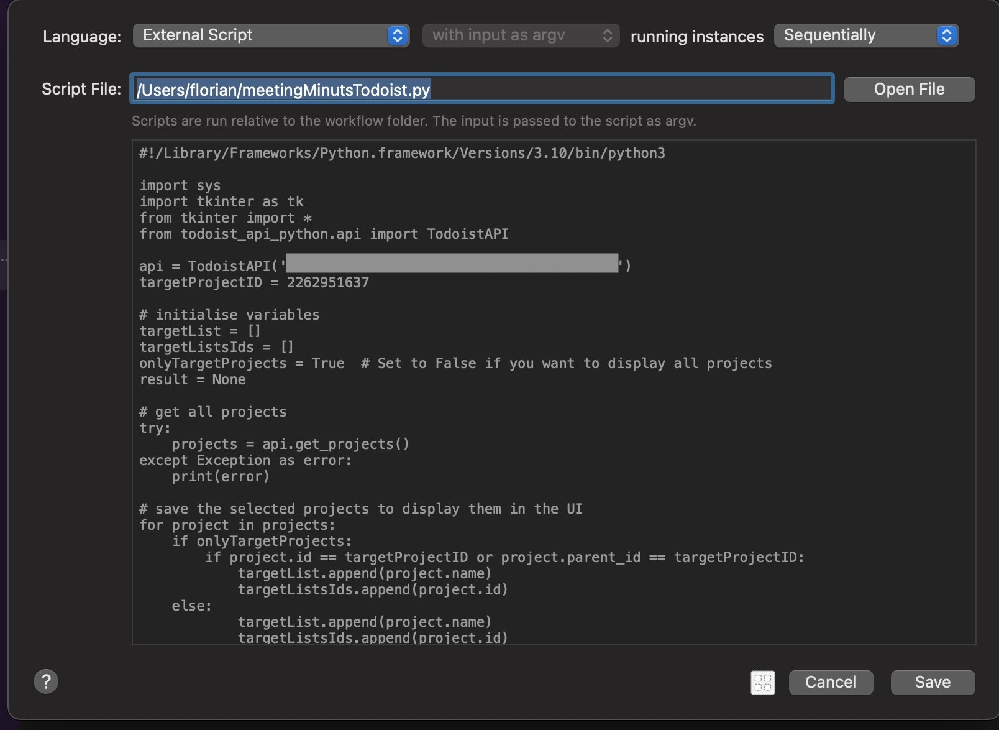

# AlfredAutomations
Some of my scripts and workflows for the productivity tool Alfred for MacOS

  
Todoist 

## My Todoist automations I use on a daily basis with Alfred 4 on MacOS

These are simple Python scripts, which I'm using daily. 

You need to install Todoist Python Modul via this command in the commandline / terminal 

`pip3 install todoist-api-python`

To get your API Code go to https://todoist.com/app/settings/integrations and scroll to the end of this site. 

### AddOneTaskToInbox.py
I use this as a workflow to add a quick todo to my Inbox no matter if todoist is running or not. I'll trigger it by the keyword "todo:". The input/text is entered as title for the task. No project assigning, due date or labels can be add via this workflow. 

To create this workflow. 

1. Create a new workflow, which is triggered by a keyword of your choice. You need to make a argument required. 

2. Add a action to run an external script (as Python3 is currently not supported in Alfred and MacOS 12.x comes without Python2.7) Past the link to your script.

## Multiple Lines to Todoist 
This my most used workflow for Todoist. The original idea was born after couple of todos from meetings. To explain that shortly: I'm writing meeting minutes for every meeting (ok the most :-) ) and I write also the todos down, which where discussed in the meeting. It was always time consuming to take this todos from the meeting and copy paste them into the project, I want them in. 

So I created this script. For each selected line it creates a task with the text in this line in an previous selected project. 

To create this workflow. 

1. Create a new workflow, which is triggered by a universal action. You need to make a argument required. 

2. Add Utilies Element "Arg and Vars" and select passthrought. 

3. Add a action to run an external script (as Python3 is currently not supported in Alfred and MacOS 12.x comes without Python2.7) Past the link to your script.  (I have a second Python version installed which has a bug in it, therefore I link directly to the correct directory in the Shebang)

4. Play a sound if you like at compeltion

  
Google Chrome 

  
 # Open Google Chrome profile from Alfred
 I'm using Chrome as my main browser for work related things. As consultant I'm using a lot of different profiles and I want to open them as quick as possible. 
 
 Therefore I created this small Alfred Workflow which reads all available Google Chrome profiles from the folder and provides a selection of all. The selected one will be opend in a new window. 
 
 I'm not an python expert and I asume that the code is pretty basic. So, I'm also thankfull for any suggestion to improve the code. 
 
**As long as you have not modified your chrome settings folder, this workflow does not need any configuration.**

To trigger the workflow simpy write `chpr`
 
 
