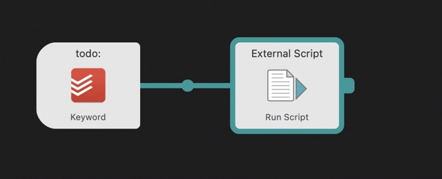

# My Todoist automations I use on a daily basis with Alfred 4 on MacOS

These are simple Python scripts, which I'm using daily. 

You need to install Todoist Python Modul via this command in the commandline / terminal 
`pip3 install todoist-api-python`

To get your API Code go to https://todoist.com/app/settings/integrations and scroll to the end of this site. 

## AddOneTaskToInbox.py
I use this as a workflow to add a quick todo to my Inbox no matter if todoist is running or not. I'll trigger it by the keyword "todo:". The input/text is entered as title for the task. No project assigning, due date or labels can be add via this workflow. 

To create this workflow. 

1. Create a new workflow, which is triggered by a keyword of your choice. You need to make a argument required. 

2. Add a action to run an external script (as Python3 is currently not supported in Alfred and MacOS 12.x comes without Python2.7) Past the link to your script.

